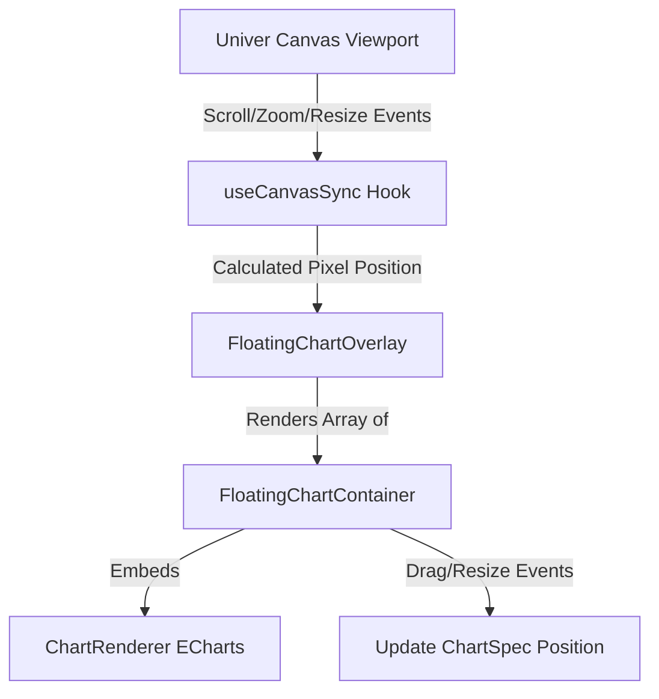

# Phase 2: Floating Overlay: Tương tác Kéo/Thả, 8-Point Resize & Đồng bộ Toạ độ Canvas

## Overview

Xây dựng lớp Floating Overlay tương tác phủ phía trên canvas của Univer. Lớp này quản lý các biểu đồ như những đối tượng nổi (floating objects), hỗ trợ kéo thả (drag & drop) di chuyển tự do, 8 điểm điều khiển phóng to/thu nhỏ (resize handles), menu ngữ cảnh (chỉnh sửa, xoá, tải ảnh) và tự động đồng bộ toạ độ tuyệt đối/tương đối khi người dùng cuộn (scroll) hoặc phóng to/thu nhỏ (zoom) trang tính.

## Requirements

- **Container tương tác**:
  - Di chuyển mượt mà (drag handle / header drag).
  - 8 điểm resize (top, bottom, left, right, 4 góc) với giới hạn kích thước tối thiểu (min width: 200px, min height: 150px).
  - Trạng thái chọn (selection outline, active z-index).
- **Đồng bộ toạ độ với Sheet Canvas**:
  - Chuyển đổi qua lại giữa toạ độ Pixel trên màn hình và toạ độ Cell (Row, Column, Offset).
  - Lắng nghe sự kiện Scroll và Zoom từ Univer instance để cập nhật vị trí overlay theo thời gian thực (tránh hiện tượng biểu đồ bị lệch khi cuộn).
- **Hành động nhanh (Quick Actions)**:
  - Nút 3 chấm menu góc trên biểu đồ: Chỉnh sửa (Edit), Xoá (Delete), Sao chép (Duplicate), Xuất ảnh PNG (Export PNG).

## Architecture & Data Flow

## Related Code Files

- Create:
  - `apps/sheets/src/modules/charts/components/FloatingChartContainer.tsx`
  - `apps/sheets/src/modules/charts/components/FloatingChartOverlay.tsx`
  - `apps/sheets/src/modules/charts/components/ChartContextMenu.tsx`
  - `apps/sheets/src/modules/charts/hooks/useCanvasSync.ts`
  - `apps/sheets/src/modules/charts/hooks/useChartInteraction.ts`
  - `apps/sheets/src/modules/charts/utils/coordinates.utils.ts`
- Modify:
  - `apps/sheets/src/components/SheetEditor.tsx` (nhúng FloatingChartOverlay bao ngoài viewport)

## Implementation Steps

1. Xây dựng helper `coordinates.utils.ts` để tính toán toạ độ pixel từ chỉ số dòng/cột (`row`, `col`, `rowHeights`, `colWidths`, `scrollLeft`, `scrollTop`, `zoomScale`).
2. Viết hook `useCanvasSync.ts` kết nối với `univerAPI` để bắt sự kiện thay đổi scroll/zoom và render lại vị trí overlay.
3. Xây dựng `FloatingChartContainer.tsx` tích hợp logic kéo thả chuột (pointer down/move/up) và 8 điểm resize handles.
4. Tích hợp `ChartContextMenu.tsx` với các thao tác nhanh (Chỉnh sửa, Xoá, Xuất ảnh).
5. Xây dựng `FloatingChartOverlay.tsx` quản lý danh sách biểu đồ thuộc sheet đang kích hoạt (`activeSheetId`).
6. Nhúng overlay vào `SheetEditor.tsx`.

## Success Criteria

- [ ] Biểu đồ hiển thị nổi trên bảng tính, đúng vị trí ô mong muốn.
- [ ] Kéo thả di chuyển và co dãn 8 hướng mượt mà, không bị giật hay nhảy vị trí.
- [ ] Khi cuộn bảng tính (ngang/dọc) hoặc phóng to thu nhỏ (zoom), biểu đồ di chuyển đồng bộ chính xác theo các ô tính.
- [ ] Nhấp menu 3 chấm có thể xoá biểu đồ hoặc xuất ra file ảnh PNG thành công.
