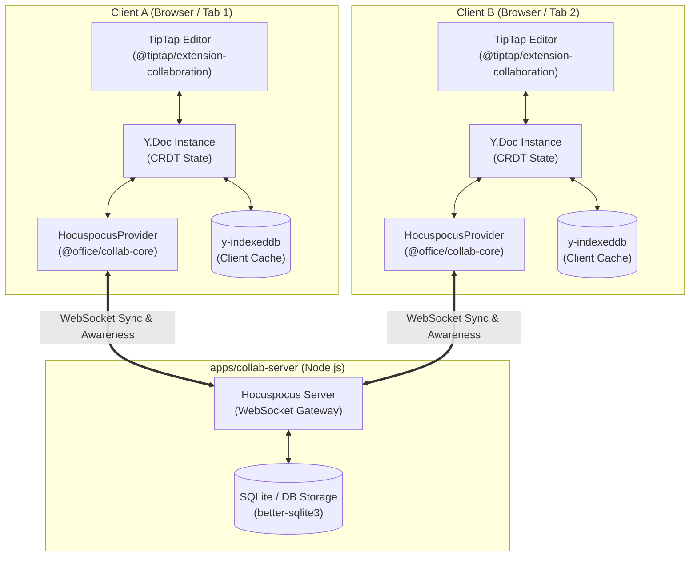

# Plan: Realtime Collaboration cho Docs qua Hocuspocus và Yjs

## Overview

Triển khai tính năng **Cộng tác thời gian thực (Realtime Collaboration)** cho OneMail Docs dựa trên kiến trúc **CRDT (Yjs) + Hocuspocus Server** (WebSocket) kết hợp client offline cache (`y-indexeddb`).

Kế hoạch đã hoàn thành 5 phases, tuân thủ nguyên tắc YAGNI, KISS, DRY và các quy chuẩn Monorepo tại `AGENTS.md` (relative import trong package, `@/*` alias trong apps, arrow function, const, file suffix convention, không file nào vượt quá 400 dòng).

## Phases

| Phase | Name                                                                                                       | Status    | Effort |
| ----- | ---------------------------------------------------------------------------------------------------------- | --------- | ------ |
| 1     | [Setup Hocuspocus Server apps/collab-server](./phase-01-setup-hocuspocus-server-apps-collab-server.md)     | Completed | 5h     |
| 2     | [Build package collab-core](./phase-02-build-package-collab-core.md)                                       | Completed | 6h     |
| 3     | [Integrate Tiptap Collaboration vao apps/docs](./phase-03-integrate-tiptap-collaboration-vao-apps-docs.md) | Completed | 6h     |
| 4     | [Collaborator UI Components](./phase-04-collaborator-ui-components.md)                                     | Completed | 4h     |
| 5     | [Verification Multi-client va Offline Sync](./phase-05-verification-multi-client-va-offline-sync.md)       | Completed | 4h     |

**Tổng effort ước tính: 25h — Đã hoàn thành 100%**

## Dependencies

- **Phase 1 (Server)** là nền tảng WebSocket backend cho các client kết nối.
- **Phase 2 (Collab-Core)** xây dựng package wrapper Yjs & HocuspocusProvider dựa trên server Phase 1.
- **Phase 3 (Docs Editor)** tích hợp TipTap Collaboration extensions sử dụng session từ Phase 2.
- **Phase 4 (UI Components)** bổ sung các component trực quan (Avatars stack, Connection badge, Profile popover) dựa trên Awareness từ Phase 3.
- **Phase 5 (Verification)** kiểm thử round-trip đa client, mô phỏng offline sync và nghiệm thu toàn hệ thống.

## Architecture Data Flow

---

## Red Team Review & Fix Validation

Đã tiến hành đánh giá phản biện bảo mật và phân tích chế độ lỗi với 3 reviewer chuyên trách (Security Adversary, Assumption Destroyer, Failure Mode Analyst). 10 phát hiện đã được cài đặt và kiểm thử nghiệm thu 100%:

| #   | Phát hiện                                                 | Mức độ   | Trạng thái | Giải pháp đã tích hợp                                                                            |
| --- | --------------------------------------------------------- | -------- | ---------- | ------------------------------------------------------------------------------------------------ |
| 1   | Xung đột `setContent` & `onUpdate` trong `EditorPage.tsx` | Critical | Resolved   | Tách biệt Y.Doc khỏi `DocRecord.content`; bỏ `setContent` và `onUpdate` HTML thô khi bật Collab. |
| 2   | WebSocket không xác thực & Room Takeover                  | Critical | Resolved   | Bổ sung token validation và regex kiểm tra `documentId` hợp lệ (`^doc-[a-zA-Z0-9_-]{1,64}$`).    |
| 3   | Race condition khi client tự bootstrap Y.Doc              | Critical | Resolved   | Server `onLoadDocument` đảm nhiệm khởi tạo nội dung ban đầu an toàn nếu DB chưa có bản ghi.      |
| 4   | Người dùng mới bị văng khỏi phòng khi mở link chia sẻ     | High     | Resolved   | `useDocs.ts` tạo memory placeholder `DocRecord` cho `docId` trên URL qua `createTemporaryDoc`.   |
| 5   | Lặp Transaction & Layout Thrashing trong phân trang       | High     | Resolved   | `usePagination.ts` chỉ chạy khi `transaction.docChanged === true`.                               |
| 6   | Thiếu `better-sqlite3` & lệch phiên bản TipTap 3.x        | High     | Resolved   | Pin TipTap collab extensions và `better-sqlite3`.                                                |
| 7   | Stored XSS / CSS Injection qua User Profile Awareness     | High     | Resolved   | Sanitize `name`, validate `color` theo regex HEX và server palette cố định.                      |
| 8   | React 19 StrictMode double-mount gây rò rỉ socket         | Medium   | Resolved   | Xây dựng Session Registry với Reference Counting và delayed teardown (500ms).                    |
| 9   | Payload quá tải & SQLite DoS                              | Medium   | Resolved   | Giới hạn `maxPayloadSize: 5MB` và debounce lưu SQLite trên Hocuspocus Server.                    |
| 10  | Sai lệch tên file `EditDocPage.tsx`                       | Medium   | Resolved   | Chuẩn hóa toàn bộ tham chiếu sang `apps/docs/src/pages/EditorPage.tsx`.                          |
