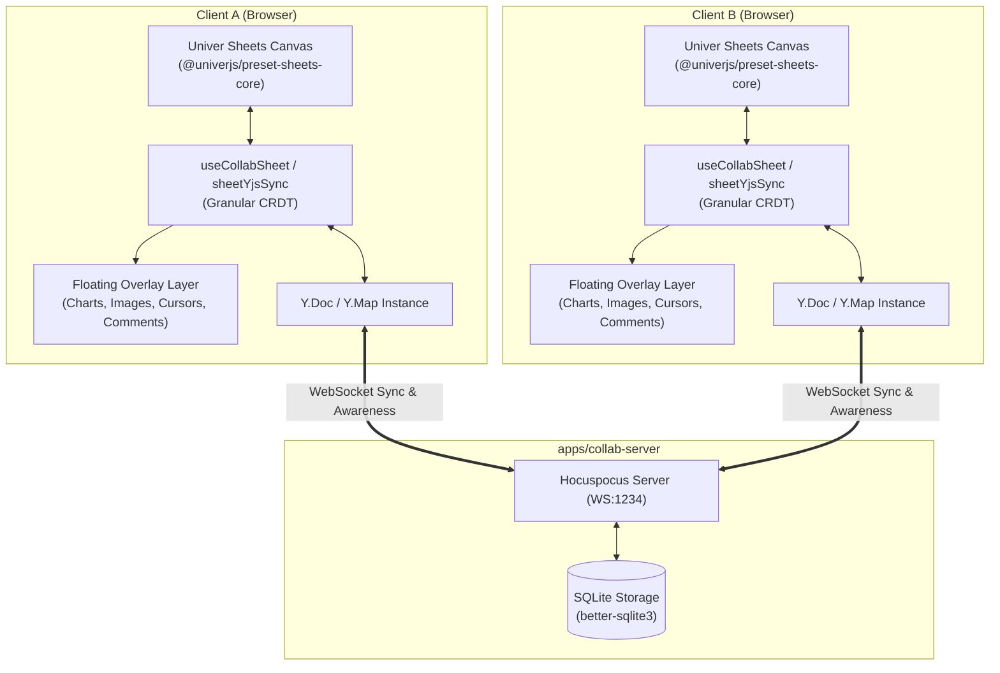

# Plan: Sheets Advanced Features — Collab, Print/PDF & Images/Comments

## Overview

Hoàn thành xuất sắc toàn bộ kế hoạch nâng cấp và hoàn thiện ứng dụng **Sheets** (`apps/sheets`) qua 3 mảng tính năng trọng tâm đã được thống nhất:
1. **Realtime Collaboration**: Tích hợp CRDT qua `packages/collab-core` (Yjs + Hocuspocus), đồng bộ cell data granular, quản lý awareness hiển thị ô đang chọn (selection boxes) và danh sách cộng tác viên.
2. **In ấn & Xuất PDF chuyên nghiệp**: Cung cấp Print Preview Modal, tùy chọn khổ giấy (A4, Letter, A3), hướng in (Portrait/Landscape), vùng in (Print Area, Selection), căn chỉnh tỉ lệ (Fit to Page / Fit to Width) và xuất tệp PDF độ nét cao (jsPDF).
3. **Hình ảnh nổi & Bình luận theo ô**: Module Floating Images (upload, kéo thả, 8-point resize, lưu trữ metadata) và Threaded Comments gắn theo địa chỉ ô (`Sheet1!B4`), hỗ trợ avatar, reply, resolve và đồng bộ qua phòng collab.

Tuân thủ nghiêm ngặt các quy chuẩn Monorepo tại `AGENTS.md`:
- Arrow functions `() => {}`, `const`, immutability.
- Path alias `@/*` trong `apps/sheets`, relative import trong `packages/*`.
- Giới hạn file code ≤ 400 dòng (modular SRP).
- Đa ngôn ngữ qua `@office/i18n` (VI/EN).
- UI component từ `@office/ui-kit` (Shadcn UI + Base UI).

## Phases

| # | Phase | File | Effort | Status |
|---|---|---|---|---|
| 1 | Realtime Collaboration: Yjs CRDT, Awareness Cursors & Collab UI | `phase-01-realtime-collaboration.md` | 14h | completed |
| 2 | Professional Print Preview & Client-side PDF Export | `phase-02-print-pdf-export.md` | 10h | completed |
| 3 | Floating Images & Threaded Cell Comments Management | `phase-03-floating-images-comments.md` | 12h | completed |

**Tổng effort hoàn thành: 36h**

## Architecture & Data Flow

